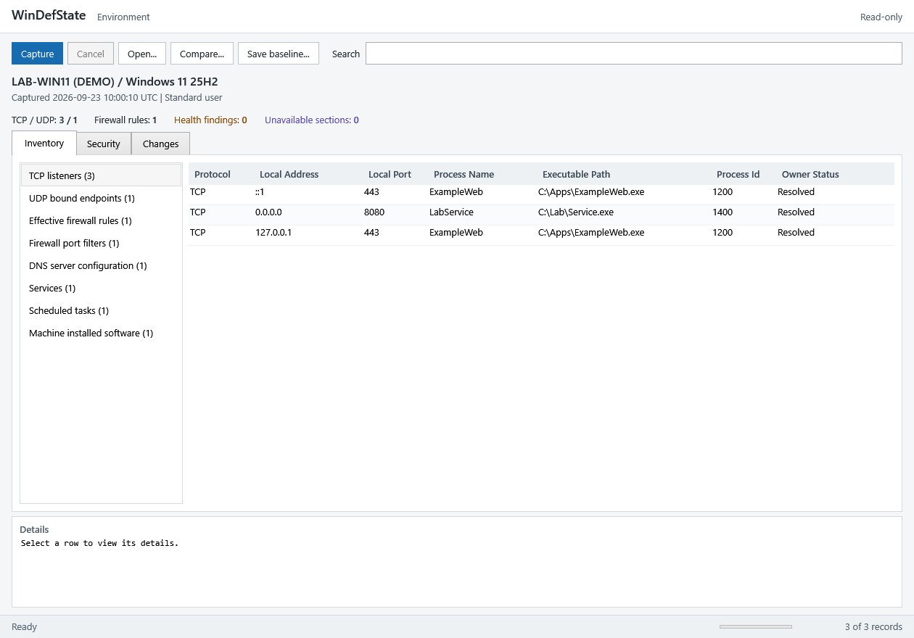

# WinDefState

Capture a Windows environment before testing and compare it afterward.

- TCP listeners and UDP endpoints, with process ownership
- Firewall rules, network configuration, services, tasks, and installed software
- Windows security health and version support
- JSON baselines, before/after comparisons, and HTML reports



## Start

[Download the source ZIP](https://github.com/mikegropp/WinDefState/archive/refs/heads/main.zip),
extract it, and run this from the extracted folder:

```powershell
powershell.exe -NoProfile -Sta -File .\WinDefState.Inspect.Gui.ps1
```

Requires Windows 10 or 11 and 64-bit Windows PowerShell 5.1. Run as administrator
for complete firewall reads. Unavailable data is marked **Unknown**.

**Capture → Save baseline → Test → Capture → Compare**

The inspection UI is read-only. Baselines record configuration; use a VM checkpoint
or disk backup for whole-machine recovery.

## Command line

Run the captures before and after testing, respectively:

```powershell
.\WinDefState.Environment.ps1 -OutputPath .\before.json
.\WinDefState.Environment.ps1 -OutputPath .\after.json
```

Compare the saved files:

```powershell
.\WinDefState.Environment.ps1 -BaselinePath .\before.json -CurrentPath .\after.json -OutputPath .\changes.html -Format Html
```

## Protection-state engine

The separate `WinDefState.ps1` engine captures and restores supported protection
settings. Its permissive test mode weakens host security and is intended for
isolated, authorized testing. Environment baselines and engine restore snapshots
are different formats. See the [state reference](docs/STATE.md).

## Documentation

- [Inspection guide](docs/INSPECTION.md) — coverage, comparisons, and limitations
- [State reference](docs/STATE.md) — saved files, recovery, and provider caveats
- [Development](docs/DEVELOPMENT.md) — tests and release builds
- [Architecture](docs/ARCHITECTURE.md) — implementation and compatibility contracts
